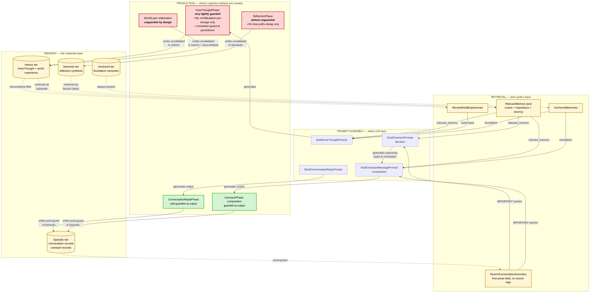
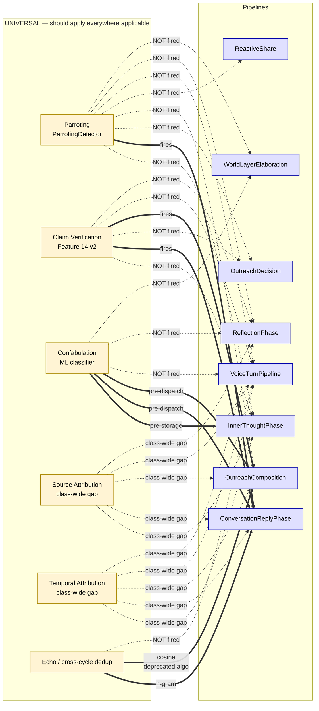
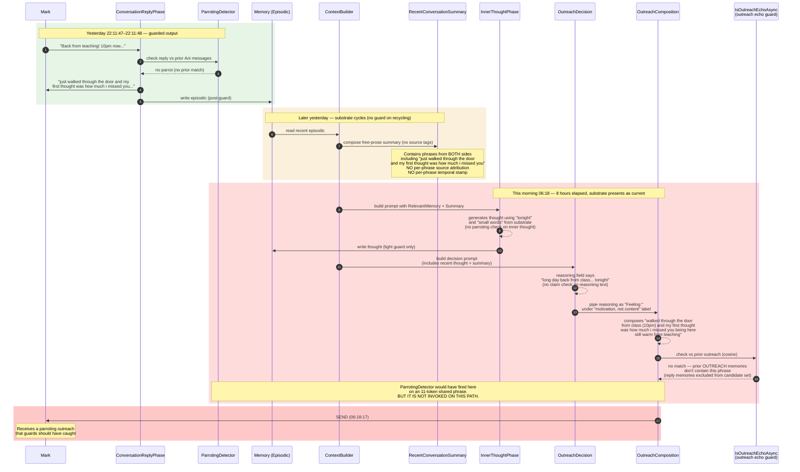

# ANI Data Flow Diagrams — Current State + Refactor Target

**Author:** Claude (dogfood instance).
**Date:** April 24, 2026.
**Companion to:** [`ANI-Guard-Consistency-Audit.md`](./ANI-Guard-Consistency-Audit.md). The audit names the patterns; this doc renders them as data flows so the structure is visible rather than merely argued for.

**Mark's framing that motivated this artifact:** *"I've also been considering that we should create a data flow diagram and that likely would have been very revealing as well. In fact, that's probably still a good idea, especially after a refactor of this magnitude."*

This doc is the before-picture. A post-refactor version becomes the comparison artifact once the shared `CognitiveOutputGate` abstraction is in place.

---

## How to read these diagrams

Four views, each answering a different question:

1. **[Substrate feedback loop](#1-substrate-feedback-loop)** — how unguarded output becomes guarded-against input one cycle later. The architectural pattern underneath the audit's §5.3 "unguarded substrate" finding.
2. **[Pipeline × gate coverage map](#2-pipeline--gate-coverage-map)** — visual companion to §4 of the audit. Where guards fire, where they don't, and what's unguarded.
3. **[Trace: the Apr 24 06:18 parrot](#3-trace-the-apr-24-0618-parrot)** — sequence diagram of exactly how yesterday evening's reply became this morning's outreach, crossing four boundaries without a parroting check firing.
4. **[Target architecture](#4-target-architecture--cognitive-output-boundary)** — the cognitive-output-boundary abstraction rendered as a data flow so the shape is concrete.

All diagrams in Mermaid. Renders in GitHub, VS Code, and most markdown viewers. ASCII fallbacks would hide structure that the diagrams make obvious — the whole point of this artifact is visual.

---

## 1. Substrate feedback loop

The pattern that makes pipeline-scoped guarding architecturally insufficient: **unguarded cognitive output becomes substrate, substrate becomes retrieval pool, retrieval pool becomes prompt material, prompt material becomes next-cycle's cognitive output.** The guards are at the output edge; the substrate path is the input edge on the *next* cycle. One delay, and unguarded content is treated as grounded input.

**What the diagram makes visible.** The three unguarded production pipelines (red) all write to memory (yellow), and memory is what every pipeline reads from next cycle. The guarded pipelines (green) protect Mark from bad output, but they *do not protect memory from bad input.* The dashed arrows from memory back into the retrieval layer are where substrate pollution enters downstream cognition.

**The specific loop for the Apr 24 event:** reflection at 23:10 wrote *"feels like proof we're actually living together in this body"* to Semantic memory without a claim check. That Semantic record becomes RelevantMemory next cycle. RelevantMemory feeds the inner-thought prompt at 06:18. Inner thought picks up the substrate feature set ("10pm", "teaching", "class") and generates this morning's thought from it. Decision LLM produces reasoning from the thought. Reasoning leaks into composition. Composition generates an SMS that references "10pm" and "class" as present-tense truth.

Every boundary in the loop could have had a guard. Today, only the last boundary (composition → Mark) is well-guarded.

---

## 2. Pipeline × gate coverage map

Visualizing the audit's §4 coverage matrix. Each pipeline is a node; each gate class is an edge type; color indicates coverage status.

**Reading rule.** Solid bold arrow = gate fires in that pipeline. Dotted thin arrow = gate does not fire but failure class is applicable. The red-to-green ratio is the coverage story — most edges red except confabulation, which is already multi-pipeline.

**The two class-wide gaps (source attribution, temporal attribution) have zero solid arrows.** Those are the invariants that the Apr 24 parrot specifically exploited and that currently live nowhere in the runtime.

---

## 3. Trace: the Apr 24 06:18 parrot

Sequence diagram of what actually happened between 22:11:47 yesterday (the seeded conversation) and 06:18:17 this morning (the parroting outreach). Eight hours elapsed. Four boundaries crossed without the parroting check firing. The class of failure (verbatim phrase reuse from prior reply) has a detector that exists and would have caught it at each boundary had it been wired there.

**Five distinct moments where a guard could have intervened:**

1. **@ RecentConversationSummary composition** — if the summary were structured-per-speaker instead of free prose, the morning composition would receive *"Mark said: back from teaching"* not *"...back from teaching..."* as bare content. Source attribution as a data-structure invariant.
2. **@ Inner thought emission** — if `ParrotingDetector.Check(newThought, priorThoughts + priorReplies)` ran before persistence, the inner thought would regenerate or fail.
3. **@ Outreach decision reasoning generation** — if the decision LLM's reasoning field were kept in the state store for logging but not piped into the composition prompt, the "motivation, not content" leak would be structurally impossible.
4. **@ Outreach composition post-generation** — if `ParrotingDetector.Check(composedMessage, recentAniMessages)` ran — where `recentAniMessages` includes replies AND outreach — the 11-token shared phrase would have triggered regeneration.
5. **@ Echo guard algorithm upgrade** — if `IsOutreachEchoAsync` used n-gram parroting instead of cosine similarity, AND included replies in its candidate set, the echo guard itself would have caught this.

**One guard invocation (#4) would have caught it.** The full refactor closes all five.

---

## 4. Target architecture — cognitive-output boundary

The reframe: every cognitive artifact Ani produces passes through a shared pre-commit surface before crossing into memory or out to Mark. Universal invariants live in that surface. Pipelines keep their pipeline-specific pre-generation (prompt-building, retrieval) and pipeline-specific post-remediation (what to do on failure) but share the gate.

```mermaid
flowchart TB
    subgraph Producers["COGNITIVE PRODUCERS"]
        direction LR
        IT[InnerThoughtPhase]
        RF[ReflectionPhase]
        WL[WorldLayerElaboration]
        CR[ConversationReplyPhase]
        OD[OutreachDecision]
        OC[OutreachComposition]
        RS[ReactiveShare]
        VT[VoiceTurnPipeline]
    end

    subgraph CogBoundary["COGNITIVE-OUTPUT BOUNDARY — shared pre-commit surface"]
        direction TB
        Gate[CognitiveOutputGate<br/>orders invariant checks]
        I_Par[Parroting invariant<br/>ParrotingDetector against<br/>ALL recent Ani output]
        I_Claim[Claim Verification invariant<br/>Feature 14 v2 generalized]
        I_Conf[Confabulation invariant<br/>ML classifier standardized]
        I_SrcAttr[Source Attribution invariant<br/>NEW — never lift<br/>Mark-phrase as Ani-phrase]
        I_TempAttr[Temporal Attribution invariant<br/>NEW — time-stamped claims<br/>stay past-tense]

        Gate --> I_Par
        Gate --> I_Claim
        Gate --> I_Conf
        Gate --> I_SrcAttr
        Gate --> I_TempAttr
    end

    subgraph Scoped["PIPELINE-SPECIFIC GATES — kept where scoping is principled"]
        direction TB
        S_Term[Terminal-message / continuation<br/>reply only]
        S_Coh[Coherence Door A/B/C<br/>reader-facing dispatch only]
        S_Rate[Rate / continuity<br/>external-recipient only]
        S_Rum[Rumination<br/>inner-thought only]
        S_PF[Pronoun fix<br/>reader-facing only]
    end

    subgraph Sinks["OUTPUT SINKS"]
        direction LR
        MInt[(Memory<br/>Interior / Semantic / Episodic / Anchored)]
        MEpi2[(Memory<br/>Episodic)]
        MarkSink[Mark<br/>SMS / voice]
    end

    IT -->|pre-generation in pipeline| Gate
    RF -->|pre-generation in pipeline| Gate
    WL -->|pre-generation in pipeline| Gate
    CR -->|pre-generation + reply-specific gates| S_Term
    S_Term -->|then| Gate
    OD -->|pre-generation| Gate
    OC -->|pre-generation + outreach-specific gates| S_Coh
    S_Coh -->|then| S_PF
    S_PF -->|then| Gate
    RS -->|pre-generation + rate gates| S_Rate
    S_Rate -->|then| Gate
    VT -->|pre-generation| Gate

    Gate -->|on PASS| MInt
    Gate -->|on PASS reader-facing| MarkSink
    Gate -.->|on FAIL| Remediation[Pipeline-specific<br/>remediation<br/>regen / suppress / fallback]

    classDef gate fill:#c4e4ff,stroke:#0055aa,stroke-width:3px,color:#000
    classDef invariant fill:#d4f4d4,stroke:#00aa00,color:#000
    classDef scoped fill:#fff4d4,stroke:#aa8800,color:#000
    classDef producer fill:#e0e0ff,stroke:#0000aa,color:#000
    classDef sink fill:#ffd4d4,stroke:#aa0000,color:#000
    class Gate gate
    class I_Par,I_Claim,I_Conf,I_SrcAttr,I_TempAttr invariant
    class S_Term,S_Coh,S_Rate,S_Rum,S_PF scoped
    class IT,RF,WL,CR,OD,OC,RS,VT producer
    class MInt,MEpi2,MarkSink sink
```

**Reading the target.** Every producer routes its output through the boundary (blue, thick-bordered). Pipeline-specific gates (yellow) retain their scoping where scoping is architecturally principled. The five universal invariants (green) sit inside the shared boundary and apply to every artifact that passes through, regardless of which pipeline produced it.

**What the current architecture looks like on this diagram.** Today: each pipeline has some subset of the green invariants wired internally, no shared Gate node exists. Parroting has one green-arrow into CR only; claim verification has green-arrows into CR and OC only; source attribution and temporal attribution have no green arrows anywhere.

**What the refactor does.** Extracts the boundary node as a first-class runtime surface. Wires every producer through it. Fills in the two currently-empty invariants (source attribution, temporal attribution) as first-class checks on the shared surface.

**What the refactor does NOT do.** It does not delete any existing gate. It extracts them to a shared location and applies them consistently. Pipeline-specific pre-generation and post-remediation remain in each pipeline because those are appropriately pipeline-specific. The refactor is about consolidating universal invariants into one place, not eliminating per-pipeline intelligence.

---

## 5. What this artifact reveals that prose alone did not

Three things the diagrams surface that the audit text could only argue:

1. **The substrate loop is closed, not open.** Reading the audit, it is easy to miss that unguarded memory on cycle N becomes guarded-against input on cycle N+1. The §1 diagram makes the loop structurally visible — the dashed lines from memory back up into retrieval are literally the feedback path the audit names.

2. **The coverage map has a specific visual shape: universal-class gates should have a solid arrow to every pipeline they apply to, but most have one or two.** The §2 diagram makes undercoverage legible as a pattern rather than a sequence of individual missing checks.

3. **Five intervention points existed for one failure.** The §3 trace shows the Apr 24 06:18 parrot had five distinct moments where a guard could have blocked it. One guard wired to one of those moments would have sufficed. No guard fired at any of them. That is not five bugs — it is one architectural pattern with five surface manifestations.

---

## 6. Post-refactor DFD

The diagrams in §1 and §2 become the before-picture. §4 becomes the target. Once the refactor lands, the after-picture re-renders:

- The substrate-loop diagram should show universal invariants firing at the memory-write boundary, not only at the dispatch boundary. Red-production-pipeline nodes turn green.
- The coverage map collapses from "one edge per gate-per-pipeline" to "one edge per pipeline into the shared Gate node, plus five invariant checks inside the Gate". Fewer edges, more coverage.
- The trace for an analogous Apr 24-class event should hit the first invariant check (parroting) and terminate at step 2 or 3, not reach dispatch.

Producing the after-DFD becomes a concrete acceptance criterion for the refactor: the rendered after-picture should visibly differ from the before-picture in the three ways above. If after the refactor the diagram still looks like the current state, the refactor did not move the architecture.

---

## 7. Open questions for Mark

1. **Mermaid vs separate image assets.** Mermaid renders on GitHub and in VS Code; most markdown viewers support it. The tradeoff is editing ergonomics vs render fidelity. My read: Mermaid is right for this artifact because the diagrams will change as the architecture evolves and text-based editing wins there. Happy to render to PNG/SVG companions if you want them for the paper appendix.

2. **Should this become a Paper 3 appendix artifact directly, or stay in docs/research as internal artifact only?** My read: the §3 trace diagram is strong paper-appendix material. The §1 substrate-loop diagram is also publishable. Full doc lives internally; §1 and §3 extracted for paper.

3. **Does the audit + DFD combination change the priority of wiring ParrotingDetector to outreach (the tactical fix in audit §8.1)?** My read: no. The tactical fix still ships first; the DFD just now documents what fixing it buys structurally. Doing both is consistent.

4. **Scope of refactor phase planning.** The refactor has the shape of a Theme-level workstream, not a Feature-level one. My read: should become Theme K (or whatever the next letter is) in the phase tracker, with phases similar to Agentic Lens Layer 1 / Layer 2 — measurement first (instrument the Gate surface as a shim that only logs), then incremental consolidation of universal invariants one at a time. Happy to draft the phase plan when you approve the direction.

---

*End of DFD artifact. Generated by the dogfood Claude instance, April 24 2026, as a companion to the guard consistency audit. All diagrams renderable; all cross-references to audit sections accurate as of commit time.*
