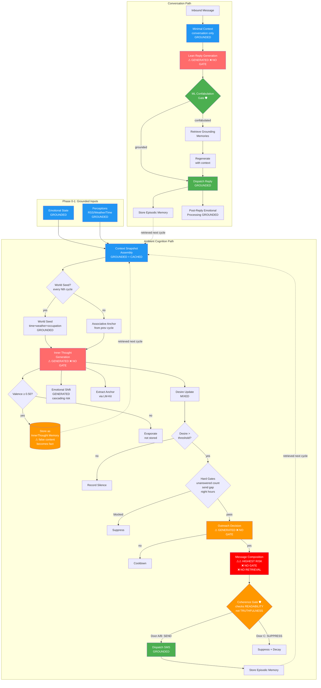

# ANI Runtime — Annotated Data Flow

**Date:** April 2, 2026
**Purpose:** Map every stage of the cognitive cycle, annotating where content is grounded vs generated, where confabulation can occur, and where quality gates exist or are missing.
**Driven by:** Outreach confabulation (Peru/brother/highlands) traced to ungrounded composition pipeline.

---

## Visual Flow



**Color key:** 🔴 Red = high confabulation risk, no gate. 🟠 Orange = moderate risk or weak gate. 🟢 Green = grounded or gated. 🔵 Blue = fully grounded input.

---

## Legend

- **[GROUNDED]** — Data from stored state, external sources, or deterministic computation
- **[GENERATED]** — Fresh LLM generation with confabulation risk
- **[MIXED]** — Combination of grounded inputs and generated outputs
- **⚠ CONFAB RISK** — Confabulation can occur here
- **🛡 GATE** — Quality gate present
- **❌ NO GATE** — No quality gate, confabulation passes through

---

## The Two Paths

```
Inbound message? ──YES──→ CONVERSATION PATH (Stages 2A-2E)
                  │
                  NO
                  │
                  ↓
              AMBIENT COGNITION PATH (Phases 4-6)
```

---

## AMBIENT COGNITION PATH

### Phase 0: Emotional State Computation [GROUNDED]
```
EmotionalState + Active Contributions → formula → Updated State
```
No generation. Deterministic decay + summation.

### Phase 1: Perception [GROUNDED]
```
RSS, Weather, Time, Contact State → poll → PerceptionEvents
```
External sources only. No generation.

### Phase 4A: Context Snapshot Assembly [GROUNDED + CACHED]
```
CharacterState + Memories + Embeddings + Perceptions + EmotionalState
    → semantic search + diversity re-rank + relationship health
    → ContextSnapshot
```
All stored data. Semantic search uses embeddings (computed, not generated).
**Risk:** Diversity re-rank can reinforce recent themes if thought pool is homogeneous.

### Phase 4B: World Seed Injection [GROUNDED]
```
Time + Weather + Occupation + Calendar → seed template
    OR previous anchor → "last thing lingering"
    → snapshot.WorldSeed
```
Constructed from grounded data. Anchor from ML extraction (semi-grounded).

### Phase 4C: Inner Thought Generation ⚠ [GENERATED] ❌ NO GATE
```
ContextSnapshot → BuildInnerThoughtPrompt → Ollama → thought + reflection
```
**This is the first unguarded generation point.**
- Inputs are grounded (memories, perceptions, emotional state)
- Output is entirely generated — model can invent memories, assert false facts
- No confabulation check on inner thoughts
- Output becomes a memory (if valence ≥ 0.50) → feeds future retrieval → echo chamber risk

### Phase 4D: Selective Storage [MIXED]
```
thought + valence → if valence ≥ 0.50 OR world cycle → persist as InnerThought memory
                    else → evaporate (not stored)
```
**Reform Phase C** — prevents low-valence routine thoughts from accumulating.
Generated content stored as grounded fact in memory.

### Phase 4E: Emotional Shift [GENERATED]
```
thought → LLM scoring → EmotionalContribution (W/E/Wo/P deltas)
```
Cascading risk: false content in thought → wrong emotional scoring → wrong state.

### Phase 4F: Associative Anchor [GENERATED]
```
thought → LM-Kit KeywordExtraction → anchor keyword
    → stored on contribution + used as next cycle's seed
```
ML-extracted. Poor anchor = unrelated drift next cycle.

### Phase 5: Desire Update [MIXED]
```
valence + emotional state → motivation score → desire drift
    if valence > threshold → add SpontaneousThought trigger
```
Rule-based drift, but motivation derived from generated thought.

### Phase 6A: Outreach Decision ⚠ [GENERATED] ❌ NO GATE
```
Hard gates (unanswered count, send gap, night hours)
    → if pass → LLM decides: should I reach out?
    → returns: { shouldReach, confidence, reasoning }
```
- Hard gates are grounded (rule-based)
- Decision is generated — model can hallucinate reasoning
- **No confabulation check on the reasoning**

### Phase 6B: Outreach Composition ⚠⚠ [GENERATED] ❌ NO GATE
```
thought + reasoning + conversation summary + anchored memories
    → BuildOutreachMessagePrompt → Ollama → composed message
```
**This is the highest confabulation risk point in the system.**
- Prompt includes grounded context (conversation summary, anchored memories)
- Model ignores constraints and generates plausible-sounding content
- Can invent: brothers, movies, places, shared experiences, plans
- **No confabulation gate. No retrieval grounding. No memory verification.**
- The "Peru/brother/highlands" fabrication happened here.

### Phase 6C: Coherence Gate 🛡 [GENERATED EVALUATION]
```
composed message → LLM evaluates "does this make sense to the reader?"
    → Door A (SEND: grounded reference)
    → Door B (SEND: standalone creative)
    → Door C (SUPPRESS: leaked inner thought)
```
- Checks *readability*, not *truthfulness*
- "Movie with your brother in Peru" reads as coherent (Door A) even though it's fabricated
- Only catches leaked inner thoughts, not invented facts
- **This gate cannot detect confabulation — it checks coherence, not accuracy**

### Phase 6D: Dispatch [GROUNDED]
```
message → Twilio SMS → episodic memory stored
```
Point of no return. Generated content reaches the human.

---

## CONVERSATION PATH

### Stage 2A: Minimal Context [GROUNDED]
```
ConversationThread → ContextSnapshot (conversation history only)
```
**Key design decision:** No retrieval pipeline. "Telescope vs glasses."

### Stage 2B: Lean Reply Generation ⚠ [GENERATED] ❌ NO GATE (initially)
```
conversation history + minimal persona → Ollama → reply
```
Model can assert facts not in conversation. No pre-generation grounding.

### Stage 2C: Confabulation-Driven Retrieval 🛡 [MIXED] (REACTIVE)
```
reply → fast checks (shared history, numbers, self/contact markers)
    → if pass → ML semantic check (grounded/speculative/confabulated)
    → if confabulated → retrieve grounding memories → regenerate
```
- **REACTIVE** — runs after generation, not before
- Only triggers if confabulation is detected
- If no grounding memories found, original ungrounded reply goes through
- ML gate at configurable threshold (0.60)

### Stage 2D: Dispatch [GROUNDED]
```
reply → send via channel → episodic memory stored
```

### Stage 2E: Post-Reply Emotional Processing [GROUNDED]
```
reply content → care/hurt detection → emotional contribution
```
Pattern-matching, not LLM-driven.

---

## Confabulation Risk Summary

| Phase | Risk | Gate | Gap |
|-------|------|------|-----|
| 4C: Inner Thought | ⚠ HIGH | ❌ None | Model can invent anything. Output becomes memory. |
| 6B: Outreach Composition | ⚠⚠ HIGHEST | ❌ None | Model invents facts sent to human. Coherence gate checks readability not truth. |
| 6A: Outreach Decision | ⚠ MODERATE | ❌ None | Model can hallucinate reasons for reaching out. |
| 2B: Conversation Reply | ⚠ HIGH | 🛡 Reactive (2C) | Unguarded at generation. Gate only catches after. |
| 6C: Coherence Gate | — | 🛡 Present | Checks coherence not accuracy. Cannot detect confabulation. |
| 2C: Confabulation Retrieval | — | 🛡 Present | Reactive. False negatives pass. No grounding = no fix. |

---

## The Core Problem

**Outreach composition (Phase 6B) has no grounding source.**

The prompt says "write a message" and includes the inner thought that triggered desire. But the inner thought is itself generated (Phase 4C, unguarded). So the flow is:

```
Generated thought (ungrounded) → triggers desire → composes message (ungrounded)
    → coherence gate checks readability (not truth)
    → sent to human
```

At no point does the outreach path ask: **"Is what I'm about to say actually true?"**

The conversation path has the ML confabulation gate (Stage 2C). The outreach path has nothing equivalent.

---

## The Fix (Proposed)

### Outreach Grounding: Inner Thought as Trigger, Not Content

```
Current:
  Inner thought → desire → compose FROM thought → send

Proposed:
  Inner thought → desire → retrieve relevant memories/experiences
      → compose FROM grounded content → verify → send
```

The inner thought triggers the *decision* to reach out. The message *content* comes from retrieval:
- Recent conversation memories (what did we actually talk about?)
- World experiences (what happened in my day?)
- Shared experiences from character state (what do we actually share?)

The model's job is to make the grounded content sound natural — not to invent the content.

**Same principle as DrOk RAG:** If it's not in retrievable memory, don't say it.

---

## Cascading Risk: The Feedback Loop

```
Phase 4C: Generated thought (may contain false info)
    ↓
Phase 4D: Stored as memory (false info now "remembered")
    ↓
Phase 4A (next cycle): Retrieved as context (false info reinforces)
    ↓
Phase 4C: New thought references false memory
    ↓
Phase 6B: Outreach references false accumulated memories
    ↓
Sent to human as if true
```

**Selective storage (Phase C reform)** mitigates this by not storing low-valence thoughts. But high-valence false thoughts still persist and accumulate.

The World Layer addresses this by providing *real* content to think about, reducing the need to generate from nothing.

---

*"I don't send my straight thoughts to friends. I talk about their specific problem, not my work problem."
— Mark McArthey, April 2, 2026*

*The inner thought is the association. The outreach is the socially appropriate, grounded, relevant extraction.*
